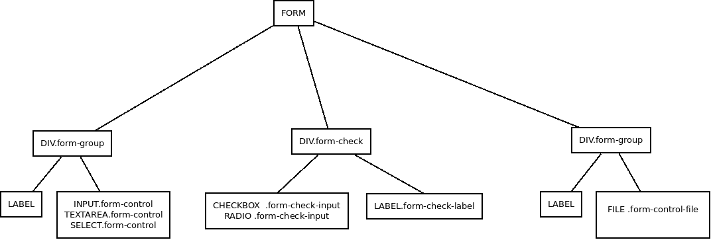

# Componente formularios

El componente BootStrap 5 formulario es un elemento complejo que además tiene muchos más componentes relacionados. 


De manera general podemos describir estas clases y la jerarquía que deben ocupar de la siguiente manera:



Además, se le añadirá al final un *input* de tipo *submit* o *button* con las clases correspondientes a los botones cuyos ejemplos más comunes (hay muchos más) son:

* **btn btn-primary**
* **btn btn-secondary**
* **btn btn-success**
* **btn btn-danger**
* **btn btn-warning**


### Modificar aspectos de los formularios.

* **Modificar el tamaño en altura del control**. Añadiendo clases como ***form-control-lg*** (grande) o ***form-control-sm*** (pequeños) en los *form-control.*
*
* **Modificar el tamaño en altura de la etiqueta del control**. Usando clases como ***col-label-lg*** (grandes)  o ***col-label-sm*** (pequeños).
*
* **Hacer que todos los elementos del formulario se vean en la misma línea** añadiendo la clase ***form-inline*** a la etiqueta form.

* **Hacer que las distintas opciones para elementos *radio* o *checkbox* se vean en la misma línea** añadiendo al div que tenía la clase *form-check* la clase ***form-check-inline***

* **Añadir texto de ayuda a los diferentes elementos** usando un etiqueta small dentro del *form-group* o *form-check* y dando a esa etiqueta las clases ***form-text*** y ***text-mute***.

* **Deshabilitar los elementos** añadiendo el atributo ***disabled*** que dará estilos BootStrap 4 al elemento deshabilitado (no se podrá interactuar con él).

### Tamaño de los formularios

En cuanto a su disposición, los formularios por defecto ocupan en anchura lo que ocupen el contenedor padre al que corresponden pero podemos adaptar su tamaño jugando con el grid de BootStrap 4 añadiendo clases ***col-X*** (o atendiendo a distintos breakpoints) al elemento que contenga la clase *form-group* o *form-check*.

Para hacer los formularios más compactos hay una nueva clase que suprime el gutter, ***form-row*** que debe ser usada en ves de *row*.

### Validación de los formularios

Para validar los formularios podemos:

1. Recurrir a la validación normal que se hace por parte de los navegadores. Esta es una validación en cliente y los estilos y los mensajes quedan establecidos por los propios navegadores.


2. Definir nuestros propios mensajes de validación en cliente. Con esto deshabilitamos los mensajes por defecto de navegador pero seguimos teniendo acceso al API de validación en JavaScript. Al hacer *submit* se añadirán los estilos correspondientes a los controles y se mostrarán los mensajes de ***valid-feedback*** o ***invalid-feedback*** . Para esto necesitamos algo de programación JavaScript.

```html

    <form class="validar" novalidate>
      <div class="form-group">
        <label>E-mail</label>
        <input type="email" class="form-control" required>
        <div class="valid-feedback">
          Todo parece correcto
        </div>
        <div class="invalid-feedback">
          Debe Introducir un correo
        </div>
      </div>
      <div class="form-group">
        <label>Password</label>
        <input type="password" class="form-control" required>
        <div class="valid-feedback">
          OK
        </div>
        <div class="invalid-feedback">
          Contraseña Incorrecta
        </div>
      </div>
      <button class="btn btn-primary" type="submit">Enviar</button>
    </form>


    <script>


      (function() {
        //Modo Estricto
        'use strict';

        // Cuando se acaba de cargar la página
        window.addEventListener('load', function() {

          //Seleccionamos los formularios que quiero validar
          var forms = document.getElementsByClassName('validar');
          console.log(forms.length);
          // Los recorro y evito que se manden los datos en caso de error
          var validation = Array.prototype.filter.call(forms, function(form) {
              form.addEventListener('submit', function(event) {
                if (form.checkValidity() === false) {
                  event.preventDefault();
                  event.stopPropagation();
                }
                form.classList.add('was-validated');
              }, false);
          });
        }, false);

      })();
    </script>
```

3. Si validamos usando el servidor podemos indicar qué campos son válidos / inválidos añadiendo las clases ***is-valid***  ***is-invalid*** a los campos del formulario. Eso mostrará los mensajes correspondientes.

Si queremos usar bocadillos en vez de simples debemos usar las clases ***valid-tooltip*** o ***invalid-tooltip***.

Este componente no posee funciones asociadas ni dispara eventos.
