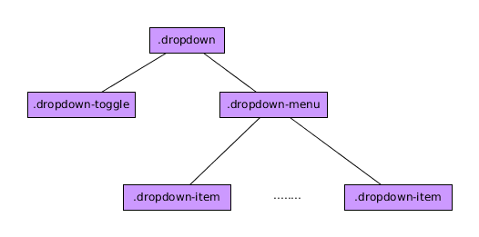

# Componente Dropdown

El componente ***dropdown*** de Bootstrap 5 es lo que conocemos como un elemento desplegable con una lista de opciones (submenú) que se muestran al hacer click sobre el elemento padre.

La estructura del DOM y las clases BootStrap 5 que debe tener un elemento Dropdown son las siguientes en su configuració básica:

.


Siendo:

* ***dropdown*** el elemento general del componente.
* ***dropdown-toggle*** el elemento que servirá para mostrar u ocultar el submenú.
* ***dropdown-menu*** el elemento que contiene las opciones.
* ***dropdown-menu-item*** cada una de las opciones.

Un ejemplo de esta estructura sería:

```html

    <div class="dropdown">
        <div class="btn btn-primary dropdown-toggle" data-toggle="dropdown">
          Muestra el submenú
        </div>
        <div class="dropdown-menu">
          <div class="dropdown-item">
            Opción 1
          </div>
          <div class="dropdown-item">
            Opción 2
          </div>
          <div class="dropdown-item">
            Opción 3
          </div>
          <div class="dropdown-item">
            Opción 4
          </div>
        </div>
    </div>

```

Es importante resaltar  que en elemento con la clase ***dropdown-toggle*** debe también poseer el atributo ***data-toggle="dropdown"*** para que el elemento funcione correctamente.

Por supuesto los colores de los botones los podemos cambiar usando la paleta de colores de BootStrap 4.

### Separar el botón de las opciones.

Si queremos dividir el botón que sirve para mostrar el submenú en dos, el texto y la flecha para desplegar tenemos que modificar un poco la estructura (aunque esta opción la encuentro de poca utilidad) y tener algo similar al siguiente ejemplo:


```html

<div class="dropdown">
    <button class="btn btn-primary">Muestra el submenú</button>
    <div class="btn btn-primary dropdown-toggle dropdown-toggle-split" data-toggle="dropdown">
      Muestra el submenú
    </div>
    <div class="dropdown-menu">
      <div class="dropdown-item">
        Opción 1
      </div>
      <div class="dropdown-item">
        Opción 2
      </div>
      <div class="dropdown-item">
        Opción 3
      </div>
      <div class="dropdown-item">
        Opción 4
      </div>
    </div>
</div>

```

### Añadir separador en el submenú

Si queremos añadir un separador dentro del submenú desplegable debemos añadir el siguiente elemento entre los grupos de opciones que queramos separar.

```html

  <div class="dropdown-divider"></div>

```

### Modificar el tamaño

Podemos hacerlo añadiendo las clases ***btn-lg*** o ***btn-sm*** a los elementos botones que nos sirven para mostrar/ocultar el menú.

### Dirección en la que aparece el menú.

Podemos mostrar el submenú en las cuatro direcciones sólo con añadir  las clases ***dropup***, ***dropright***, ***dropleft*** al elemento general. Si no ponemos nada la opción por defecto es hacia abajo. **IMPORTANTE** Tiene que caber....si no coge la opción por defecto.

### Alineación del submenú

Por defecto los submenú se posicionan a la izquierda pero si quiero puedo posicionarlos a la derecha añadiendo la clase ***dropdown-menu-right*** al elemento que ya tiene la clase ***dropdown-menu***.

### Más consideraciones:

* Puedo añadir sin problemas formularios dentro de los elementos con la clase ***dropdown-menu*** aunque tendré que ajustar posteriormente su posición.
* Para hacer que un elemento sea el elemento activo del submenú deberé añadir la clase ***active*** y para hacer que esté deshabilitado le añadire la clase ***disabled***.


## Funciones asociadas

Las más importantes son:

* ***.dropdown('toggle')*** Cambia el estado del dropdown de un elemento de navegación
* ***.dropdown('update')*** Actualiza la posición de un elemento.
* ***.dropdown('dispose')*** Destruye el componente.


## Eventos asociados

La interacción con este tipo de elementos genera 4 nuevos tipos de eventos, bastante auto explicativos por su nombre y de los cuáles, para saber más detalles deberemos visitar el manual de referencia.

* ***show.bs.dropdown***
* ***shown.bs.dropdown***
* ***hide.bs.dropdown***
* ***hidden.bs.dropdown***
