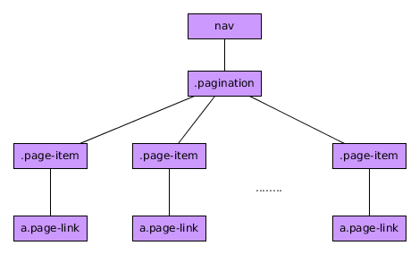

# Componente Pagination

El componente BootStrap 5 *Pagination*  es un componente sencillo de BootStrap  5 que permite navegar entre grupos de contenidos relacionados a lo largo de distintas páginas.


Tiene, de manera general. la siguiente jerarquía:



Un ejemplo de dicho componente sería:

```html

  <nav>
    <div class="pagination pagination-sm">
      <div class="page-item">
        <a class="page-link" href="#">Anterior</a>
      </div>
      <div class="page-item">
        <a class="page-link" href="#">1</a>
      </div>
      <div class="page-item">
        <a class="page-link" href="#">2</a>        
      </div>
      <div class="page-item">
        <a class="page-link" href="#">3</a>
      </div>
      <div class="page-item">
        <a class="page-link" href="#">4</a>
      </div>
      <div class="page-item">
        <a class="page-link" href="#">Siguiente</a>
      </div>
    </div>
  </nav>

```


## Posibles modificaciones

* Puedo hacer que un elemento sea destacado como el activo añadiendo la clase ***active*** al elemento que tiene la clase ***page-item***.
* Puedo hacer que un elemento se muestre como desactivado  añadiendo la clase ***disable*** al elemento que tiene la clase ***page-item***.
* Puedo modificar el tamaño añadiendo las clases ***pagination-lg*** (grande) o ***pagination-sm*** (pequeño) al elemento que tiene la clase pagination.
* Para alinear horizontalmente el elemento paginación utilizaré las clases de BootStrap 5 pertenecientes a las [utilidades flexbox](https://getbootstrap.com/docs/5.0/utilities/flex/).


Este componente no posee funciones asociadas ni dispara eventos.
