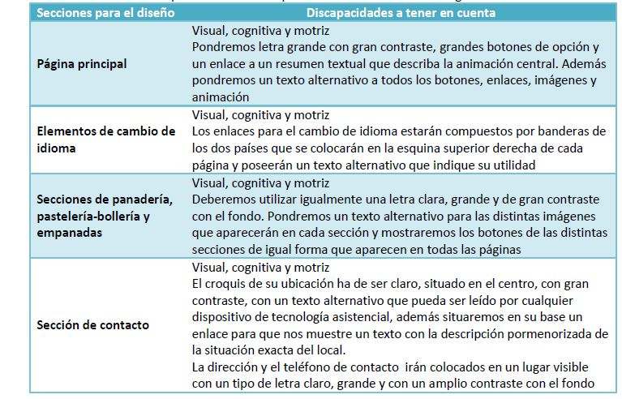


## Enunciado
Disponemos del [código fuente](CodigoFuente) de un sitio Web implementado según las siguientes especificaciones:

- Interfaz visual: en la página principal se verá una animación con dibujos mostrando el proceso de elaboración del pan.
- Tres secciones: panadería, pastelería - bollería y empanadas.
- Se permite la lectura del sitio en dos idiomas: Castellano y Portugués
- Se muestra para cada producto elaborado una imagen y una breve descripción de los ingredientes y el sistema de elaboración
o Mostrar la información de contacto con la dirección, el teléfono y un croquis de su ubicación.

1. Elaborar una tabla donde se indique, para **cada una de las especificaciones** del diseño anterior, el **tipo/s de discapacidad**: visual, auditiva, cognitiva, motriz que habrá que tener en cuenta.
2. Indica qué técnicas se te ocurre usar para cumplirlos  requisitos definidos en las WCAG 2 para los tipos de discapacidad considerados en cada caso.
Posible solución:

