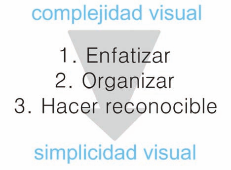
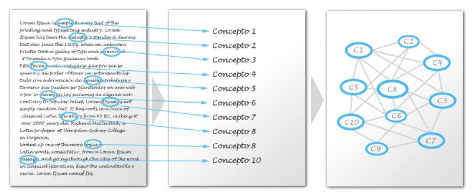
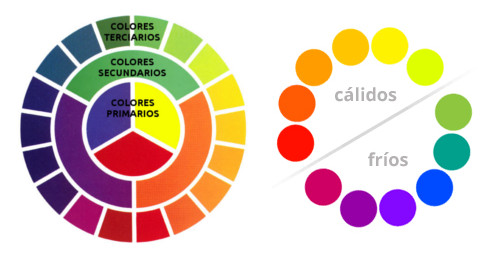
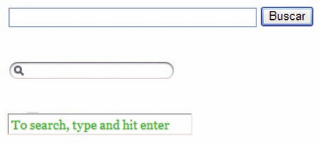
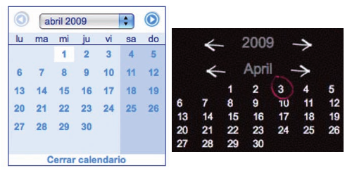
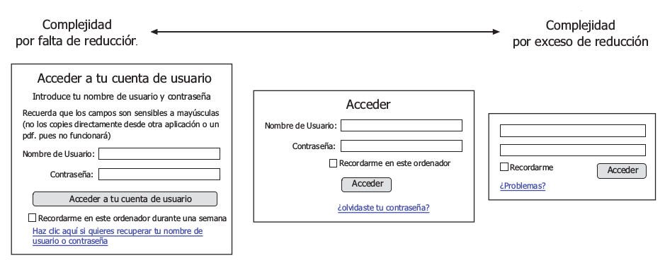
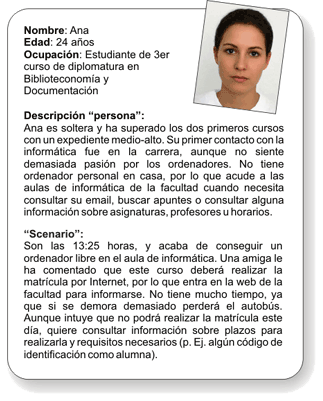

# El autor

## Adolfo Sanz De Diego
# Introducción

# Glosario de términos

## Usabilidad (I)

- La usabilidad se refiere a la capacidad de un software de ser **comprendido, aprendido, usado y ser atractivo para el usuario**, en condiciones específicas de uso. (ISO/IEC 9126)

- La usabilidad se refiere al **grado de eficacia, eficiencia y satisfacción** con la que un producto permite alcanzar objetivos, a usuarios, en un contexto de uso específico. (ISO/IEC 9241)

## Usabilidad (II)

- Podemos observar que la usabilidad se compone de dos tipos de atributos:

    - **Atributos cuantificables de forma objetiva**: como son la eficacia o número de errores cometidos por el usuario durante la realización de una tarea, y eficiencia o tiempo empleado por el usuario para la consecución de una tarea.

    - **Atributos cuantificables de forma subjetiva**: como es la satisfacción de uso, medible a través de la interrogación al usuario.

## Usabilidad (III)

- Los usuarios no buscan usabilidad, buscan utilidad, entendida como el **provecho, beneficio e interés que produce su uso**.

- Un producto será usable en la medida en que el **beneficio que se obtenga de usarlo justifique el esfuerzo necesario para su uso**.

- Pensemos por ejemplo en los **automóviles**: son herramientas que requieren de un gran esfuerzo de aprendizaje y adaptación por parte de sus usuarios, aunque no por ello son percibidos como artefactos poco usables.

## Usabilidad (IV)

- La usabilidad **no sólo es relativa a sus usuarios, sino también a los usos**. Por ejemplo, un **microondas** puede ser usado para guardar zapatos, pero no se pensó para eso, por lo tanto puede resultar no usable en ese contexto.

- Además, **los objetivos y contextos previstos determinarán la importancia de su usabilidad**. Por ejemplo, un **teléfono móvil** puede ser usado para realizar una llamada de emergencia, o para escuchar las diferentes melodías que incorpora, un objetivo este último para el que la usabilidad puede que no sea tan relevante como para el primero.

## Accesibilidad

- La accesibilidad se refiere a la capacidad del sistema a para **facilitar el acceso a todas las personas** en igualdad de condiciones, independientemente de la tecnología o soporte que utilicen y de la discapacidad que puedan presentar.

## Experiencia Usuario

- Capacidad de una interfaz de **generar sensaciones y emociones**, en el usuario, durante el proceso de interacción.

## Diseño Centrado Usuario

- Proceso de diseño y desarrollo (del sitio web) **conducido por el usuario**, sus necesidades, características e intereses.

# Conocer al usuario

## ¿Cómo ve? (I)

- Decidimos qué queremos atender visualmente, pero **nuestra atención se ve interferida involuntariamente y de forma automática por determinadas características visuales**, aún cuando hagan presencia en zonas de visión periférica.

## ¿Cómo ve? (II)

- En las interfaces web sucede igual: los usuarios escanearán visualmente la interfaz en busca de propiedades gráficas propias de los objetos deseados –enlaces, textos, imágenes, ...–, y esta **exploración puede verse facilitada si el diseñador enfatiza aquellos elementos potencialmente más relevantes**, o por el contrario entorpecida cuando nada parece visualmente más relevante que el resto.

## ¿Cómo ve? (III)

- La capacidad que tiene un elemento visual de atraer la atención del usuario se encuentra en directa **relación con sus diferencias gráficas** respecto a los elementos colindantes.

## ¿Cómo ve? (IV)

- Un elemento con **mayor tamaño** que el resto, con un **color distinto** a los demás, con una **orientación diferente**, o **en movimiento**, tendrá más probabilidad de atraer nuestra atención.

## ¿Cómo ve? (V)

- Esto es algo que comprendieron los **diseñadores de banners**, pero los usuarios aprendieron a ignorar automáticamente todo aquello que, por sus propiedades gráficas (y ubicación), pareciera información publicitaria (lo fuera o no).

- La **publicidad contextual**, popularizada por Google, intenta atraer nuestra atención por el camino contrario: en vez de por medio de su diferenciación gráfica, mediante su similitud, de tal forma que el usuario tenga la impresión de que por su aspecto pueda tratarse de contenido de interés.

## ¿Cómo ve? (VI)

- Mejorar el **diseño visual**:

## ¿Cómo ve? (VII)

- **Enfatizar**: implica hacer visible lo relevante, establecer una clara jerarquía visual entre elementos y zonas de la interfaz, de modo que la atención del usuario se vea guiada de forma lógica y secuencial de lo más relevante hacia lo secundario.

## ¿Cómo ve? (VIII)

- **Organizar**: significa establecer relaciones visuales lógicas, que faciliten de este modo al usuario relacionar o diferenciar elementos automáticamente. Por ejemplo, que los enlaces tengan todos una misma caracterización gráfica (color, tipografía, efectos), facilita al usuario que, una vez detectado un enlace, pueda diferenciarlos automáticamente.

## ¿Cómo ve? (IX)

- **Hacer reconocible**: considerar con especial cuidado el uso de iconos, encabezados, enlaces... de tal forma que se requiera del usuario el menor de los esfuerzos para comprender y predecir el funcionamiento interactivo de la interfaz.

## ¿Cómo piensa? (I)

- Cada vez que aprendemos algo extraemos nuestro propio **mapa mental**.

## ¿Cómo piensa? (II)

- ¿Cómo **clasificaríamos** los colores?

## ¿Cómo piensa? (III)

- ¿Primarios, secundarios y terciarios?
- ¿O cálidos y fríos?

## ¿Cómo piensa? (IV)

- ¿Cúal de las 2 clasificaciones es mejor para mi interfaz?

- Dependerá de nuestros usuarios.

- Hay que intentar **adaptar nuestros contenidos a los mapas mentales** de nuestros usuarios.

## ¿Cómo piensa? (V)

- Un usuario será capaz de identificar la función de cada elemento sólo **si ha aprendido previamente su significado**.

- Además **el significado dependerá del contexto**. Un mismo usuario asociará sentidos diferentes a un enlace con el rótulo “Archivos”, en función de si se encuentra visitando un sitio web de noticias, un repositorio de software o la página web de una asociación de Bibliotecas, Museos y Archivos.

## ¿Cómo piensa? (VI)

- ¿Cuales de estos formularios de búsqueda no utilizarías para tu interfaz web?

## ¿Cómo piensa? (VII)

- ¿Cuales de estos calendarios no utilizarías para tu interfaz web?

## ¿Cómo actúa? (I)

- Mecanismo **intuitivo**:
    - se caracteriza por ser muy rápido, susceptible a errores y fundamentalmente emocional
    - se disparan reglas automáticas o heurísticas –adquiridas en base a nuestra experiencia– que nos ofrecen una solución rápida, y nos posibilitan un comportamiento eficiente.

## ¿Cómo actúa? (II)

- Mecanismo **racional**:
    - es un proceso lineal, lógico, consciente y que requiere esfuerzo y tiempo
    - es menos propenso a errores, además de que podemos –frente a un error– modificar el proceso, corrigiendo el resultado.

## ¿Cómo actúa? (III)

- Normalmente empleamos el **sistema intuitivo pues nos permite economizar nuestro esfuerzo cognitivo**, y sólo usamos  **sistema racional para las decisiones realmente importantes**.

- Esto explica por qué, por ejemplo, ante una ventana de alerta en la que se nos pregunta algo y se nos ofrecen dos posibles respuestas (sí y no), **es frecuente que automáticamente hagamos clic sin leer o procesar el contenido de la pregunta**.

## ¿Cómo actúa? (IV)

- El usuario explorará los ítems y **elegirá el primero que crea se corresponde con el contenido deseado**, aún cuando no todos hayan sido valorados.

## ¿Cómo actúa? (V)

- La **ordenación alfabética sería una solución universal**, si no fuera porque no siempre somos capaces de verbalizar nuestra necesidad informativa y, aún cuando lo somos, dicha representación sintáctica no tiene por qué coincidir con el término utilizado en la interfaz.

## ¿Cómo actúa? (VI)

- La mejor solución es reducir el número de ítems, **agrupando aquellos semánticamente similares bajo rótulos descriptivos**, de tal forma que el usuario primero explorará los rótulos de cada grupo, y sólo cuando estime que se encuentran relacionados con su necesidad, explorará los ítems contenidos en el grupo.

## ¿Cómo actúa? (VII)

- Los usuarios no son idiotas, sino que **tienen mejores asuntos en los que emplear su esfuerzo cognitivo** que en comprender nuestro diseño.

- No todo a lo que atendemos es procesado racionalmente, lo que **nos lleva a cometer errores** frecuentemente.

# Evitar errores

## Limitar posibilidades

- Siempre hay que tener en cuenta que cuantas menos opciones, menos posibilidades de error tendrá el usuario.

## Orientar al usuario

- Ya sea mostrándole paulatinamente las distintas opciones, o mostrándoles pequeños mensajes informativos.

## Solicitar confirmación

- Antes de realizar una acción que no tiene vuelta atrás, hay que informar al usuario.

## Evitar la pérdida de información

- En caso de error y vuelta atrás, el usuario no debería volver a introducir los datos.

## Permitir deshacer

- Siempre que sea posible, hay que ofrecer al usuario la posibilidad de volver atrás.

## Ofrecer solución automática a los errores

- No siempre es posible, pero si es deseable que el propio sistema sea capaz de ofrecer soluciones automáticas.

## Mensajes de error para humanos

- Si aparece un mensaje de error este tiene que ser entendible por el usuario.

# Simplicidad

## Reducción

- Si prescindimos de un elemento, y el cambio no afecta a la comprensión del usuario, entonces su presencia no era necesaria.

## Espacios vacíos

- Al separar elementos con espacios vacíos, **guiamos la atención hacia aquello que permanece y es relevante**.

## Equilibrio de características

- Al incrementar el número de características se observa **un efecto positivo sobre las capacidades percibidas, pero un efecto negativo sobre la usabilidad percibida**.

## Gráfico de Rob Tanenn

## Organizar, clasificar y ordenar

- Organizar, clasificar y ordenar **son también formas de simplificar**.

- Por ejemplo, Google no simplifica los resultados de búsqueda por clasificación, sino por ordenación.

# Metodología DCU

## Fases

## Planificación

- Se basa en la **recogida, análisis y ordenación de toda la información posible**, con el objetivo de tener una base sólida sobre la que poder tomar decisiones de diseño en las siguientes etapas del proceso.

## Diseño (I)

- Diseñar o rediseñar, **en base al conocimiento obtenido** en la etapa de planificación, y en las etapas de prototipado y evaluación.

## Diseño (II)

- Dividido en varias subfases:
    - Modelado usuario
    - Diseño conceptual
    - Diseño de interacción
    - Diseño visual
    - Definición de estilo
    - Diseño contenidos

### Modelado usuario (I)

- Definición de **arquetipos de usuarios** que representan patrones de conducta, objetivos y necesidades.

### Modelado usuario (II)

- Estos arquetipos, llamados "**personas**", son descripciones de usuarios, a los que se les da una identidad inventada: fotografía, nombre,... pero con los atributos, características y necesidades del arquetipo basados en información real extraída de la audiencia objetiva del sitio web.

- Además se deben definir "**scenarios**" sobre los que poder contextualizar la interacción persona-aplicación web.

### Modelado usuario (III)

### Modelado usuario (IV)

- El diseñador **suele imaginarse a sí mismo usando el sitio** y por tanto suele ser incapaz de comprender por qué a alguien le puede resultar difícil, incomodo y hasta frustrante su uso.

- Estos arquetipos de usuarios conseguirán que el diseñador **tenga en mente a un usuario 'real'**, con limitaciones, habilidades y necesidades reales.

### Diseño conceptual

- Definición del **esquema de organización, funcionamiento y navegación del sitio**.

- No se especifica qué apariencia va a tener el sitio, sino que se centra en su arquitectura de información.

### Diseño de interacción

- Definir el comportamiento interactivo del sitio web, es decir, qué **acciones se ofrecerán al usuario en cada momento, y cómo responderá la aplicación** a las acciones que realice.

### Diseño visual (I)

- Se especifica:
    - **composición** de cada tipo de página,
    - **aspecto y comportamiento** de los elementos de interacción y
    - **presentación** de elementos multimedia.

### Diseño visual (II)

- **“lo bonito” es percibido por el usuario automáticamente como más fácil de usar** (aunque desde un punto de vista objetivo realmente no sea tan fácil de usar).

### Diseño visual (III)

- Ahora bien, **ofrecer un aspecto gráfico aparentemente tosco y poco cuidado puede aportar valor** en determinados contextos.

- La estética, al igual que la usabilidad, es relativa a sus usuarios y contextos de uso.

### Definición de estilo

- Es importante mantener una **coherencia y estilo común** entre todas las páginas.

- Es útil elaborar una **guía de estilo** que sirva de documento referencia para todo el equipo de desarrollo.

### Diseño contenidos (I)

- **Seguir una estructura piramidal**: La parte más importante del mensaje debe ir al principio.

- **Evitar ser irrespetuoso**: Intentar no dañar sensibilidades culturales, sociales, políticas, religiosas, o de cualquier otro tipo.

### Diseño contenidos (II)

- **Permitir una fácil exploración del contenido**: El lector en entornos Web, antes de empezar a leer, suele explorar visualmente el contenido para comprobar si le interesa. Usar los niveles de encabezado (h1, h2, h3, etc.), poner en relieve (negrita y/o distinto color) las partes fundamentales.

### Diseño contenidos (II)

- **Un párrafo, una idea**: Cada párrafo es un objeto informativo. Se deben trasmitir ideas, mensajes... evitando párrafos vacíos o varios mensajes en un mismo párrafo.

- **Ser conciso y preciso**: Al lector no le gusta leer en pantalla. Hay que intentar eliminar los textos superfluos. Las páginas web no son novelas.

### Diseño contenidos (III)

- **Usar el vocabulario del usuario**: No se debe utilizar el vocabulario de la empresa o institución, sino el del usuario. Además debe ser sencillo y fácilmente comprensible.

- **Tono familiar y cercano**: Así el lector prestará más atención. No hay que caer en la ordinariez.

## Evaluación

- La usabilidad la podemos mediante varias variables:
    - facilidad de aprendizaje (Learnability)
    - eficiencia
    - facilidad de ser recordado (Memorability)
    - eficacia
    - satisfacción

### Aprendizaje

- Dificultad para llevar a cabo tareas básicas **la primera vez que se enfrentan al diseño**.

    - % tareas completadas en el primer intento
    - % de usuarios que completan las tareas en el primer intento
    - % de usuarios que necesitan ayuda en el primer intento

### Efectividad

- Dificultad para llevar a cabo tareas concretas **una vez que los usuarios han aprendido el funcionamiento básico**.

    - % tareas completadas
    - % de usuarios que completan las tareas
    - % de usuarios que necesitan ayuda

### Reconocimiento

- Dificultad para llevar a cabo tareas concretas **después de un periodo sin hacerlo**.

    - % tareas completadas pasado un cierto tiempo sin usar la interfaz
    - % de usuarios que completan las tareas pasado un cierto tiempo sin usar la interfaz
    - % de usuarios que necesitan ayuda pasado un cierto tiempo sin usar la interfaz

### Eficiencia

- **Esfuerzo** que un usuario tiene que hacer para conseguir un objetivo.

    - tiempo en completar cada tarea
    - número de errores cometidos
    - nivel de gravedad de los errores
    - tiempo en recuperarse de los errores
    - clicks para completar la tarea
    - páginas visitas para completar la tarea
    - número de veces que solicita ayuda

### Satisfacción

- Variables que tienen que ver más con lo **emocional o subjetivo**.

    - % de usuarios que lo recomendaría a un amigo
    - número de adjetivos positivos (o negativos) que cada usuario da al producto
    - % de usuarios que lo califican más fácil de usar que el de la competencia
    - % de usuarios que expresan satisfacción (o insatisfacción)

## Navegación
Una interfaz de navegación estará bien diseñada si se comprueban ciertos aspectos básicos:
     - El usuario sabe en todo momento dónde está. 

     - Todos los documentos tienen títulos claros. El título es el primer elemento que los navegadores leen y que se visualiza en los marcadores y en las pestañas del mismo.

     - Incorpora referencias que permiten saber lo actualizada que está la información.

     - Se muestra información sobre la persona/entidad autora o propietaria de los contenidos para proporcionar mayor confianza.
	 
Los sitios web deben ser atractivos para los usuarios que los visitan, pues de ello dependerá que compren, se registren o las dos cosas según el caso. Para facilitar la navegación existen recomendaciones:
     - Enlaces "Volver": a la hora de incluir enlaces y botones es importante describir al usuario hacia dónde va a volver (por ejemplo, volver al inicio). Son importantes al realizar procesos interactivos con formularios, ya que en esos casos usar el botón de volver del navegador puede provocar el reenvío de datos de los mismos al servidor y obtener resultados no deseados.

     - Menú de navegación siempre accesible: le evoca al usuario la sensación de tener el control sobre sus movimientos a través del sitio web. Si la estructura y la navegación es adecuada el usuario debería ser capaz de acceder a la información que busca utilizando menos de 3 clics.

     - Identificación de la situación actual en el sitio web.

     - Velocidad de conexión y de carga de los sitios web: se deben evitar los sitios pesados, que impidan la rapidez de descarga con optimización de las imágenes, gráficos y animaciones. Si una página tarda mucho tiempo en cargar lo habitual es que el usuario la abandone. 

## Implementación y lanzamiento

- Para controlar la calidad de la implementación se pueden **utilizar validadores** automáticos de código, así como validadores para testar de forma semi-automática el cumplimiento de directrices de accesibilidad en el código.

## Mantenimiento y seguimiento

- Un sitio web **no es una entidad estática**, sus contenidos y su audiencia cambian, y por lo tanto requiere de continuos rediseños y mejoras.

- Estos **rediseños deben ser muy sutiles**, pues aunque estos cambios estén fundamentados en problemas de usabilidad descubiertos post-lanzamiento, los cambios pueden resultar dramáticos para los actuales usuarios que ya estaban acostumbrados y familiarizados con el actual diseño.

# Principios usabilidad

## Jakob Nielsen

- <https://es.wikipedia.org/wiki/Jakob_Nielsen>

## Visibilidad estado

- El sistema (o sitio web) siempre debe **informar al usuario acerca de lo que está sucediendo**, como por ejemplo, cuando en una interfaz tipo webmail se adjuntan ficheros a un mensaje, el sistema debe informar del hecho mostrando un mensaje de espera.

## Adecuación al mundo real

- El sistema debe hablar el **lenguaje del usuario**, huyendo de tecnicismos incomprensibles o mensajes crípticos.

## Libertad y control

- El usuario debe tener el control del sistema, ser él el que decida.

- Se debe ofrecer siempre una forma de "**salida de emergencia**", como por ejemplo la opción para "saltar" animaciones de introducción

## Consistencia y estándares

- Consistencia en el **estilo** (enlaces iguales, pestañas iguales, etc.)

- Seguir **estándares de diseño** ampliamente aceptados:
    - usar iconos conocidos y utilizados
    - icono de la empresa con enlace a la home arriba a la izquierda
    - menú en la parte superior
    - opciones a la izquierda o a la derecha
    - pie de página con un resumen del mapa de la web

## Prevención de errores

- Mejor que un buen mensaje de error es un **diseño que prevenga** que ocurra el error.

## Reconocimiento antes que recuerdo

- Hacer **visibles objetos, acciones y opciones** para que el usuario no tenga por qué recordar información entre distintas secciones o partes del sitio web o aplicación.

- El usuario **no tiene por qué recordar** dónde se encontraba cierta información, o cómo se llegaba a determinada página.

## Flexibilidad y eficiencia

- El sitio debe ser **fácil de usar para usuarios inexpertos**.

- Pero también proporcionar **atajos o aceleradores para usuarios avanzados**.

## Diseño estético y minimalista

- Las páginas **no deben contener información irrelevante o innecesaria**.

- Cada **información extra compite con la información relevante** y disminuye su visibilidad.

## Manejo de errores

- Los mensajes de error deben **expresar claramente cuál ha sido la causa** del problema.

- También deben **sugerir las posibles alternativas o soluciones**, como por ejemplo mensajes del tipo "Usted quiso decir...".

- Además se debe **guardar el contenido** introducido por el usuario para que no tenga que volver introducirlo y pueda subsanar el error.

## Ayuda y documentación

- Aunque es mejor que un sitio web se pueda utilizar sin necesidad de ayuda o documentación, **en sitios web extensos o en procesos de interacción complejos se debe proporcionar información de ayuda** al usuario.

## Tognazzini

##  Anticipación

- el sitio web debe anticiparse a las necesidades del usuario. No esperes que el usuario busque o recuerde información o herramientas. Muestra al usuario toda la información y herramientas necesarias para cada etapa en su trabajo.

##  Autonomía

- los usuarios deben tener sensación de control sobre el sitio web. Deben saber dónde está y qué puede hacer en cada instante.

##  Los colores han de utilizarse con precaución para no dificultar el acceso a los usuarios con problemas de distinción de colores.

##  Consistencia

- las aplicaciones deben ser consistentes con las expectativas de los usuarios, es decir, con su aprendizaje previo.

##  Eficiencia del usuario
	
- los sitios web se deben centrar en la productividad del usuario, no en la del propio sitio web. En ocasiones tareas con mayor número de pasos son más rápidas de realizar para una persona que otras tareas con menos pasos, pero más complejas.

##  Reversibilidad
	
- un sitio web ha de permitir deshacer las acciones realizadas.

##  La ley de Fitts indica que el tiempo para alcanzar un objetivo con el ratón está en función de la distancia y el tamaño del objetivo. A menor distancia y mayor tamaño, más facilidad para usar un mecanismo de interacción.

##  Reducción del tiempo de latencia
	
- se debe optimizar el tiempo de espera del usuario, permitiendo la realización de otras tareas mientras se completa la previa e informando al usuario del tiempo pendiente para la finalización de la tarea.

##  Aprendizaje
	
- los sitios web deben requerir un mínimo proceso de aprendizaje y deben poder ser utilizados desde el primer momento.

##  El uso adecuado de metáforas facilita el aprendizaje de un sitio web, pero un uso inadecuado de estas puede dificultar enormemente el aprendizaje.

##  La protección del trabajo de los usuarios es algo prioritario, se debe asegurar que los usuarios nunca pierden su trabajo como consecuencia de un error.

##  Legibilidad
	
- el color de los textos debe contrastar con el del fondo, y el tamaño de fuente debe ser suficientemente grande.

##  Seguimiento de las acciones del usuario: almacenando información sobre su comportamiento previo se ha de permitir al usuario realizar operaciones frecuentes de manera más rápida 

##  Interfaz visible
	
- se deben evitar elementos invisibles de navegación que no sean evidentes.

# Técnicas de evaluación

## Card-sorting (I)

- Esta técnica consiste en solicitar a un grupo de participantes que **agrupen los conceptos representados en tarjetas** por su similitud semántica.

## Card-sorting (II)

- En el reclutamiento de participantes debemos asegurarnos de que:
    - los elegidos tienen **perfiles acordes con los usuarios reales** o potenciales del sitio web,
    - **muestran interés** por el tipo de sitio web a evaluar y,
    - a ser posible, **tienen experiencia usando sitios web de naturaleza similar**.

## Card-sorting (III)

- El que los participantes estén motivados resulta crucial para el éxito de la prueba, por lo que será muy importante ofrecerles algún tipo de **remuneración o recompensa** por su colaboración en la prueba.

## Card-sorting (IV)

- El card-sorting **abierto (sin categorias) tiene el objetivo de descubrir qué tipo de categorización o agrupación de los conceptos resultará más natural y acorde con el modelo mental** compartido de la audiencia del sitio web.

- El card-sorting **cerrado (con categorias) es recomendable para evaluar si una categorización resulta predecible** para el usuario.

## Card-sorting (V)

- Dado que el abierto ayuda en la toma de decisiones organizativas, y el cerrado evalúa esas decisiones, **el abierto debe preceder al cerrado**.

- Ambos tienen propósitos diferentes y complementarios y **su utilización combinada puede ofrecernos una imagen más fiel** el modelo mental del usuario.

## Card-sorting (VI)

- Existen **aplicaciones que automatizan y facilitan la recogida de datos y su análisis estadístico**, por lo que son recomendables cuando el propósito es el análisis cuantitativo.

- Como desventaja podemos señalar que **los participantes suelen encontrar más divertido el card-sorting manual**, y por tanto suelen estar más concentrados durante la tarea.

## Card-sorting (VII)

- Los "conceptos" suelen **representar categorías u opciones de navegación**, y por tanto lo que se pretende es extraer cuál sería la mejor forma de agruparlas o clasificarlas.

- Es una prueba destinada a adaptar la arquitectura de información al modelo mental del usuario, por tanto **tiene lugar en etapas tempranas** del proyecto.

## Evaluación heurística (I)

- Método de inspección de un sitio web que se basa en el **recorrido y análisis del sitio identificando errores y problemas de diseño**.

- Normalmente la lleva a cabo un grupo reducido de evaluadores que, en base a **su propia experiencia**, fundamentándose en reconocidos **principios de usabilidad**, y apoyándose en **guías elaboradas para tal fin**, evalúan de forma independiente el sitio web, contrastando finalmente los resultados con el resto de evaluadores.

## Evaluación heurística (II)

- El número ideal de evaluadores debe ser entre 3 y 5: **con menos de 3 muchos problemas quedarán sin detectar, y con más de 5 aumentaría el coste** sin ofrecer resultados que los justificasen.

- Cada evaluados examinará el diseño de forma independiente, y una vez finalicen, hacenn una puesta en común de los problemas, y elaborarán un **informe final consensuado**.

## Evaluación heurística (III)

- Cuanto más esperamos para su realización, más costoso resultará la reparación de los errores, por lo que **no sólo debemos realizar este tipo de pruebas una vez implementado, sino también, sobre los prototipos**.

## Evaluación heurística (IV)

- Tiene como ventaja la **facilidad y rapidez** con la que se puede llevar a cabo.

## Evaluación heurística (V)

- Permite identificar **más problemas de usabilidad menores**, pero menos problemas de usabilidad mayores.

- No puede sustituir al test de usuarios, ya que resulta **menos eficaz en la detección de problemas de usabilidad que mayor impacto** tendrán en el usuario final.

- Puede reportar **falsas alarmas**, es decir, identificar como un problema de usabilidad aquello que realmente no lo es.

## Test de usuarios (I)

- Se basa en la **observación y análisis de cómo un grupo de usuarios reales utiliza el sitio web**, anotando los problemas de uso con los que se encuentran.

## Test de usuarios (II)

- El número de participantes que son necesarios para detectar los problemas más importantes de usabilidad de un diseño se encuentra **en torno a 15**.

- Es mejor llevar a cabo **3 pruebas, con 5 participantes por cada una, repartidas en diferentes momentos** del proceso de desarrollo.

## Test de usuarios (III)

- El **reclutamiento de participantes, y su remuneración, es similar a la técnica de Card-Sorting**, anteriormente mencionada.

## Test de usuarios (IV)

- La **primera impresión** que se lleve el participante supone una información de gran relevancia para entender la capacidad comunicativa del diseño.

- "**Test de 5 segundos**", con o sin objetivo concreto: mostrándole la página durante 5 segundos y preguntándole posteriormente cuál ha sido su primera impresión, qué contenidos cree que ofrece o puede encontrar en ese sitio web.

## Test de usuarios (V)

- A continuación solicitaremos al participante una serie de tareas a realizar, analizando los errores que cometa, el tiempo empleado y su satisfacción. Es decir, **medimos tanto la usabilidad objetiva, como la usabilidad subjetiva**.

## Test de usuarios (VI)

- Requisitos de las tareas:
    - **Ser razonables**: Es decir, tareas típicas que un usuario real llevaría a cabo.
    - **Ser específicas**: La tarea no puede se demasiado genérica, sino que debe describir objetivos concretos.
    - **Ser factibles**: Encomendar al usuario tareas irrealizables no aporta información útil sobre los problemas reales.

## Test de usuarios (VII)

- Requisitos de las tareas:
    - **Estar descritas en términos de objetivos finales**: La tarea debe contextualizarse bajo un objetivo o motivación mayor.
    - **Duración razonable**: Si la tarea requiere demasiado tiempo, sería recomendable descomponerla en sub-tareas.

## Test de usuarios (VIII)

- Una forma valiosa de obtener información consiste en **solicitar al participante que exprese verbalmente** durante la prueba qué está pensando, qué no entiende, por qué lleva a cabo una acción o duda.

- Este protocolo tiene tiene el inconveniente de que el hecho de contar lo que uno hace y por qué lo hace **altera** la forma en la que se hacen las cosas.

## Test de usuarios (IX)

- Una alternativa consiste en que el participante **primero realiza la tarea y, una vez finalizada, expresa verbalmente** cómo recuerda que ha sido su proceso interactivo.

## Test de usuarios (X)

- Cuanto más esperamos para su realización, más costoso resultará la reparación de los errores, por lo que **no sólo debemos realizar este tipo de pruebas una vez implementado, sino también, sobre los prototipos**.

## Test de usuarios (XI)

- Es una prueba complementaria a la evaluación heurística, pero **es más costosa, por lo que es recomendable realizarla siempre después de una evaluación heurística**.

- Sus **resultados son más fiables, y posibilitan el descubrimiento de errores de diseño** imposibles o difíciles de descubrir mediante la evaluación heurística.

## Eye-tracking (I)

- Conjunto de tecnologías (hardware y software) que permiten **monitorizar y registrar la forma en la que una persona mira una determinada escena o imagen**, en concreto en qué áreas fija su atención, durante cuánto tiempo y qué orden sigue en su exploración visuales.

## Eye-tracking (II)

## Eye-tracking (III)

- Resultan **muy similares a los test con usuarios**, siendo diferente la tecnología usada para registrar el comportamiento del usuario, y siendo diferente lo que se pretende analizar con mayor detalle: la exploración visual del usuario.

## Eye-tracking (IV)

- Pequeños cambios en estos diseños, pueden hacer que los patrones de exploración varíen, por lo que es una técnica **recomendable sólo sobre diseños elaborados**.

## Eye-tracking (V)

- Sigue siendo una **tecnología cara**.

- Hay que tener en cuenta que ofrecen **datos cualitativos escondidos bajo la apariencia de datos cuantitativos**: analizar una interfaz con 5 participantes generará una gran cantidad de datos, pero desde el punto de vista estadístico, sigue siendo una muestra de 5 sujetos.

## Feedback (I)

- La información más valiosa sobre la usabilidad de un diseño **la obtenemos observando el comportamiento de los usuarios**, no preguntándoles.

- Esto no quiere decir que el feedback de usuario no sea útil, sino todo lo contrario, pues nos ayuda a conocer la **satisfacción subjetiva del usuario**.

## Feedback (II)

- Esta información puede ser obtenida:
    - **de forma pasiva**: a través de los mensajes enviados por los usuarios
    - **de forma activa**: por medio de entrevistas, cuestionarios y encuestas

## Feedback (III)

- Las opiniones expresadas por los usuarios indican posibles problemas de usabilidad, pero **no son en sí mismas la respuesta a los problemas**.

- Si un usuario envía un email preguntando por qué desde la home no encuentra un enlace al recurso X, no significa que debamos implementar este enlace, sino que posiblemente el recurso X sea poco visible o de difícil localización.

## Feedback (IV)

- No se deben hacer preguntas del tipo "¿Preferiría que el diseño fuera de tal forma?", sino del tipo **"¿Ha tenido algún problema para localizar el recurso X?" ó "¿Le ha resultado fácil el uso de la herramienta X?"**.

## Analítica Web (I)

- Es una técnica que sólo puede llevarse a cabo **una vez que el sitio web ha sido lanzado** y es usado diariamente.

- Se trata de una **técnica fiable y muy económica**, pues no hay sesgo ni necesidad de invertir en la identificación y reclutamiento de participantes.

- Se trata de una información muy valiosa que puede servirnos para la **toma de decisiones sobre el rediseño** en sitios web implementados.

## Analítica Web (II)

- Existen muy diversas formas de aprovechar los datos a fin de mejorar la usabilidad:
    - **identificar los usuarios** de nuestra web (edad, sexo, estudios, etc.)
    - analizar dónde **hacen clic**,
    - comprobar **las horas de mayor uso** de nuestra web,
    - analizar que páginas de nuestro site son las **más visitadas**,
    - comparar dos páginas con la misma función pero diferente diseño (**Test A/B**),

## Analítica Web (III)

- Existen muy diversas formas de aprovechar los datos a fin de mejorar la usabilidad:
    - analizar las **rutas de navegación** que siguen los usuarios,
    - detectar donde se producen mayor número de **errores**,
    - analizar **las consultas** que hacen los usuarios en el buscador interno,
    - conocer **de donde llegan** los usuarios a nuestra página,
    - etc.

## Test A/B (I)

- Consiste en **comparar dos versiones** de una misma página y ver cuál funciona mejor.

- Se divide el tráfico de la página, de tal forma que **el un porcentaje vea la versión A y el otro la versión B**.

- La alternativa que consiga **el objetivo buscado en más usuarios gana**.

## Test A/B (II)

## Test A/B (III)

- **Cualquier elemento** de una página web (versión A) es susceptible de ser cambiado para generar una alternativa (versión B).

- Puedes probar **títulos, subtítulos, o entradillas** alternativas para tus contenidos, puedes jugar con diferentes versiones de **color** y texto del botón de compra, puedes variar el **tamaño** de las ofertas, de los precios, del **orden** del menú...

## Test A/B (IV)

- **Identifica un problema o un punto de mejora**. “Muy pocos usuarios de los que vienen a mi web acaban visitando la página de precios de mi servicio, donde tengo el botón de comprar”.

- **Investiga qué hacen los demás y cómo lo hacen**. Mira las páginas de inicio de tu competencia y aprende cómo otros incitan, desde su página de inicio, a visitar la página de precios.

## Test A/B (V)

- **Plantea una posible solución**. “Si pongo un botón aquí haciendo hincapié en que las dos primeras semanas son gratis, creo que conseguiré aumentar las visitas a la página de precios.”

- **Define la métrica para determinar el éxito del test**. Dependiendo del objetivo, podremos elegir: la tasa de conversión, la tasa de rebote, número de clicks, incluso si testamos una página de atención al cliente podemos poner como métrica el número de llamadas, o el número de mails.

## Test A/B (VI)

- **Crea la alternativa e inicia el experimento**. Crea la versión B con la solución que intuyes es mejor.

- **Analiza los resultados**. Pasado un cierto tiempo, si la solución alternativa:
    - es mejor, establece esa alternativa como la versión por defecto
    - iguales, quédate con la que más te guste
    - es peor, has evitado integrar en tu web un cambio que te perjudicaría

## Test A/B (VII)

- Una herramienta gratuita y muy popular es **Google Website Optimizer**:
    - <http://www.google.com/websiteoptimizer>

- Existen **otras alternativas** más completas, aunque de pago:
    - <http://www.ricardotayar.com/2012/01/15/herramientas-software-ab-testing-multivariante/>

# Acerca de

## Licencia

- Estas **transparencias** están bajo una licencia Creative Commons Reconocimiento-CompartirIgual 3.0:
    - <http://creativecommons.org/licenses/by-sa/3.0/es>

## Bibliografía (I)

- Diseño Web Centrado en el Usuario: Usabilidad y Arquitectura de la Información
    - <http://www.upf.edu/hipertextnet/numero-2/diseno_web.html>

- Informe APIE sobre Usabilidad
    - <http://www.nosolousabilidad.com/manual/index.htm>

- Unas notas sobre Usabilidad
    - <http://www.slideshare.net/betabeers/usabilidad-18953630>

## Bibliografía (II)

- Pruebas de Usabilidad
    - <http://www.slideshare.net/pecesama/pruebas-de-usabilidad-10112899>

- Métodos de Usabilidad y Diseño Centrado en el Usuario
    - <http://www.slideshare.net/GUINALIU/mtodos-de-evaluacin-de-usabilidad>

- Prototipado
    - <http://www.slideshare.net/olgacarreras/prototipado-14077585>

## Bibliografía (III)

- Usabilidad y diseño centrado en la experiencia del usuario
    - <http://www.slideshare.net/laceves/usabilidad-y-diseo-centrado-en-la-experiencia-del-usuario>

- ¿A qué esperas para usar Test A/B en tu web? ¡Tu competencia ya lo hace!
    - <http://www.elultimoblog.com/test-ab/>
